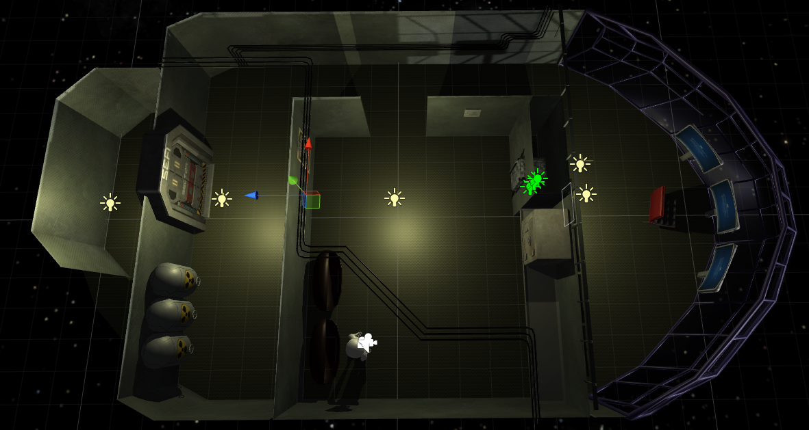
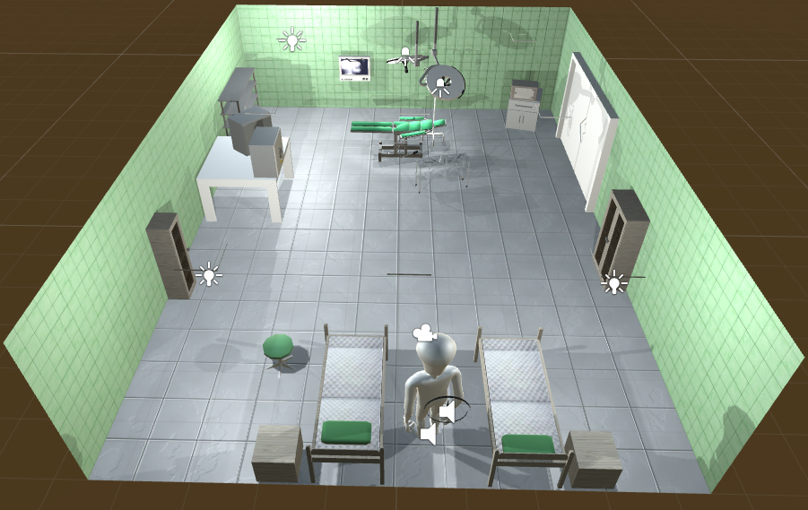

# Escape the room

Game is based on previous [KNI Kernel](http://kernel.fis.agh.edu.pl/) work.

Levels:

## How to play
WSAD - Movement  
SPACE - Jump  
E - Use/pick up object  
Q - Drop Object  

## Contributing

Unity 5 was used to develop this project.
In order to open project in Unity you must have Blender installed. Open folder `Unity Project` in Unity. 
Place new .blend files inside `Unity project\Assets\3D`. Do not use `3D stuff` folder, 
these files should be migrated into `Assets\3D`.

### [Solution](Solution.md)
